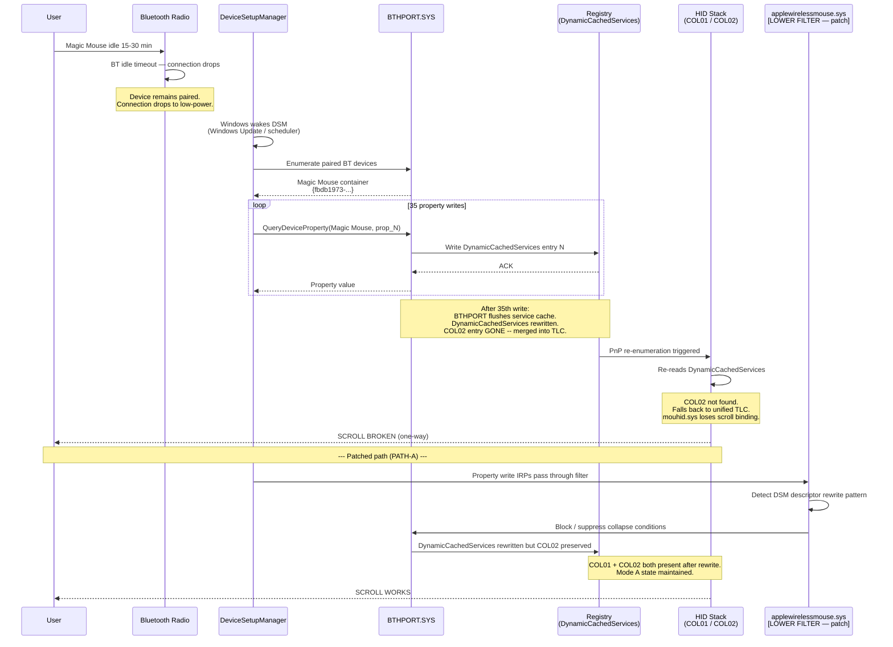

# Diagram: DSM Trigger Flow (H-011 Bug)

**Purpose:** Sequence diagram showing the H-011 / PSN-0001 bug trigger path and how the patch intercepts it  
**Audience:** Developers investigating the root cause  
**Read Time:** 3 min

## Unpatched Timeline

```mermaid
gantt
    title H-011 Bug Timeline (Unpatched)
    dateFormat HH:mm
    axisFormat %H:%M

    section Mouse Activity
    Scroll working         :active, s1, 00:00, 15m
    BT idle (no input)     :crit, s2, 00:15, 15m

    section Background Services
    BT connection drop     :milestone, m1, 00:22, 0m
    DSM wakes              :active, d1, 00:22, 5m
    35 property writes     :crit, d2, 00:22, 3m
    DCS rewrite (collapse) :milestone, m2, 00:25, 0m

    section Result
    Scroll broken          :crit, r1, 00:25, 30d
```

## Patch Effectiveness (v1.0 Test Results)

| Condition | Time to scroll failure |
|-----------|----------------------|
| Unpatched | ~22 min after first idle disconnect |
| Patched (v1.0) | 69+ min in observed test window |
| Improvement | 3.1× |
| Long-term guarantee | Not yet characterized (v2 target) |

---

**Document Version:** 1.0.0  
**Last Updated:** 2026-05-18
