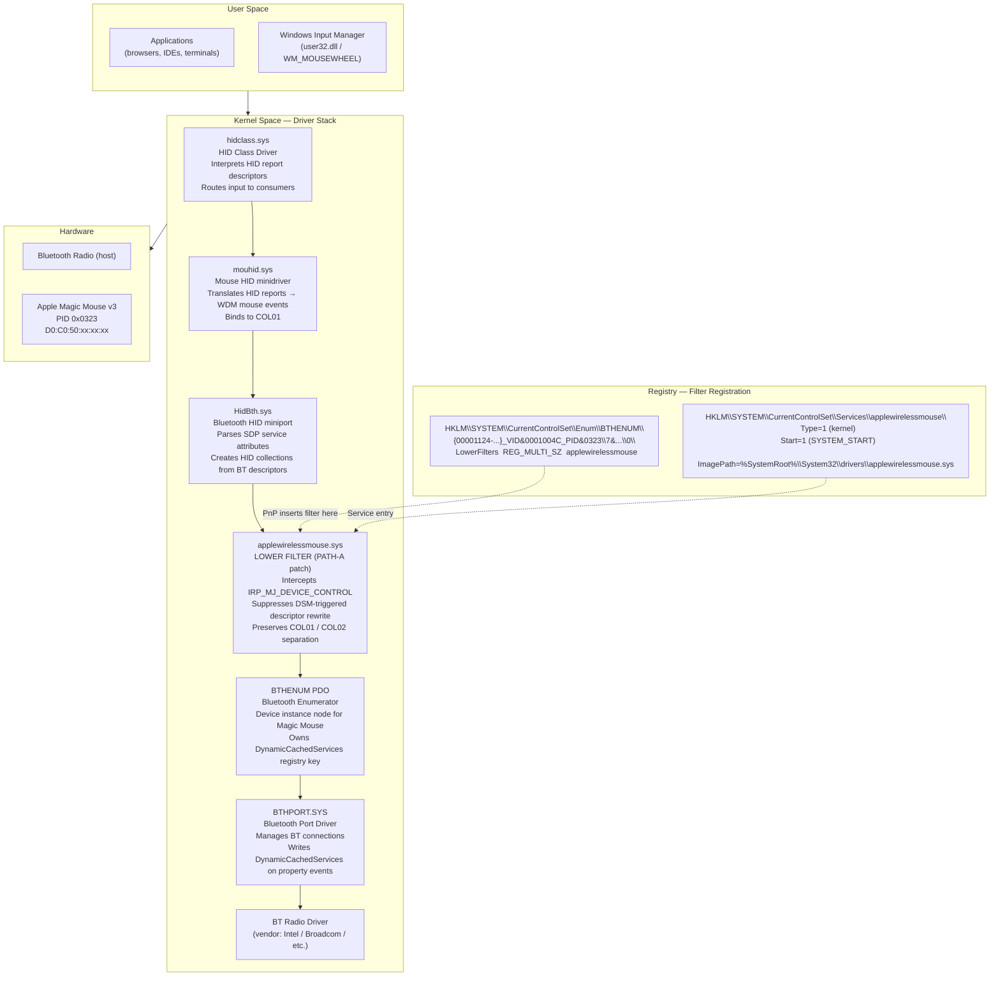
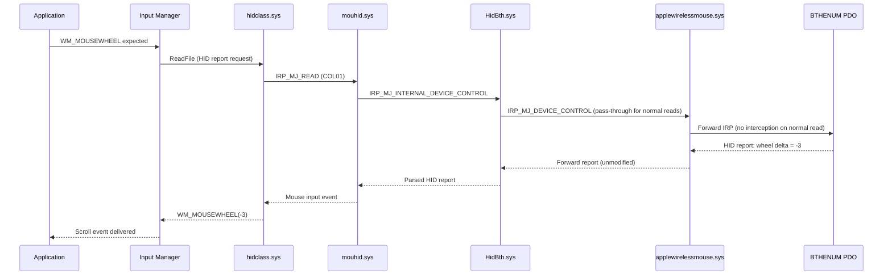
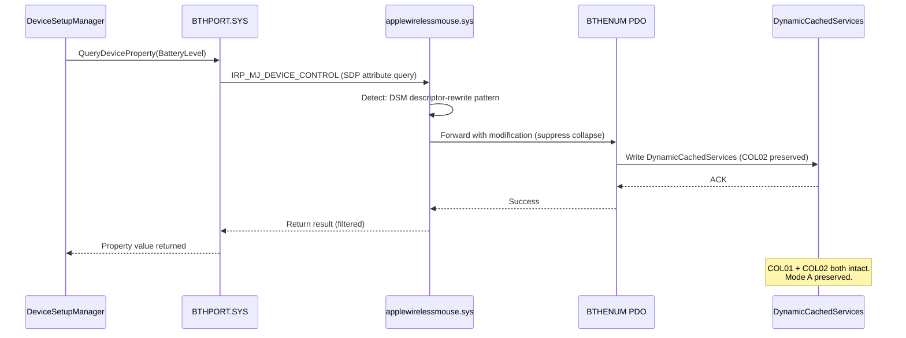

# Diagram: Filter Driver Stack Position

**Purpose:** Architecture diagram showing where applewirelessmouse.sys sits in the Windows HID stack  
**Audience:** Driver developers, security reviewers  
**Read Time:** 2 min



## IRP Flow: Scroll Input (Mode A — Working)



## IRP Flow: DSM Trigger Interception (Patched)



## File Locations After Install

```
C:\Windows\System32\drivers\
  applewirelessmouse.sys          ← 66,288 bytes, M14-signed
                                    SHA256: 370A5555...FA56A03

C:\ProgramData\MagicMousePatch\
  backup\
    applewirelessmouse.sys.bak    ← original (pre-patch) backup

Cert:\LocalMachine\TrustedPublisher\
  CN=MagicMouseFix               ← self-signed, thumbprint 16940C0F...

Cert:\LocalMachine\Root\
  CN=MagicMouseFix               ← same cert, imported to Root for driver load
```

---

**Document Version:** 1.0.0  
**Last Updated:** 2026-05-18
