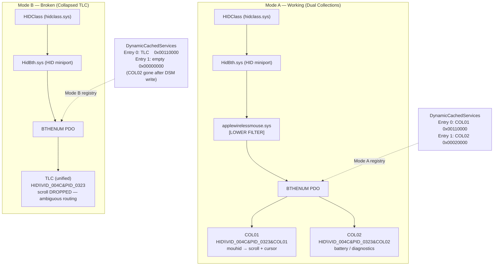
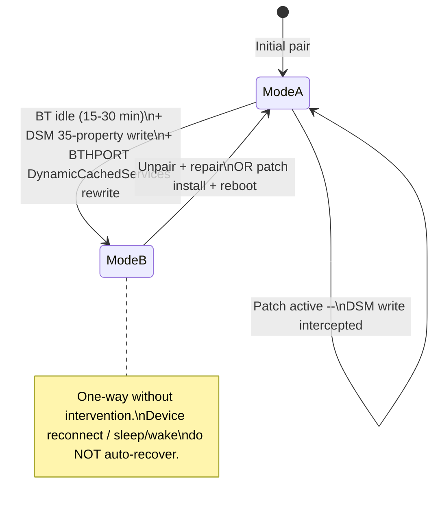

# Diagram: Mode A vs Mode B HID Stack

**Purpose:** Side-by-side comparison of working (Mode A) vs broken (Mode B) HID collection structure  
**Audience:** Developers, advanced users diagnosing scroll failure  
**Read Time:** 2 min

## Key Differences

| Item | Mode A | Mode B |
|------|--------|--------|
| COL01 | Present, independent | Merged into TLC |
| COL02 | Present, independent | **Gone** |
| Lower filter | applewirelessmouse.sys loaded | Not present (or irrelevant — TLC already collapsed) |
| Scroll | Working | **Broken** |
| Trigger | Fresh pair or patch protecting | DSM 35-property write → BTHPORT DynamicCachedServices rewrite |
| Recovery | N/A | Full device unpair/repair, or patch install |

## State Transition

---

**Document Version:** 1.0.0  
**Last Updated:** 2026-05-18
